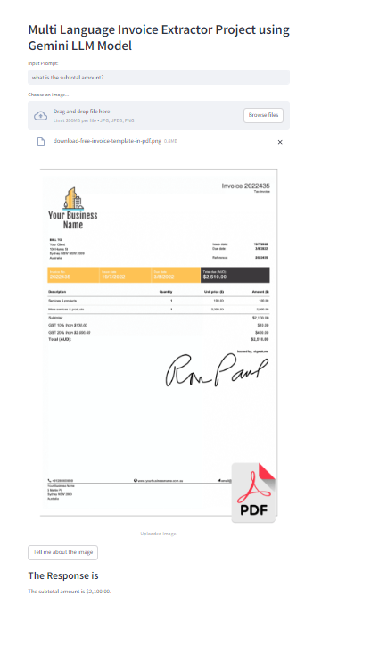
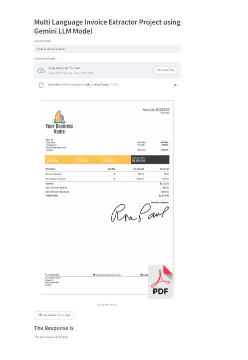

# Multi-Language Invoice Extractor

This project uses **Google’s Gemini Flash LLM** to build a multi-language invoice extractor. It processes invoices in multiple languages and extracts key details, allowing users to query the content through a simple Streamlit interface.

## Features

- Multi-language invoice processing.
- Key detail extraction and query resolution.
- Interactive interface via Streamlit.

## Tech Stack

- **Google Gemini Flash LLM** for language generation.
- **Streamlit** for UI.
- **Python** for backend logic.
- **Pillow** for image processing.

## How It Works

1. Upload an invoice image.
2. Enter a query.
3. Get extracted details and answers from the invoice.

## Output Example

Here is an example of how the extracted details are displayed:

## License

MIT License.
