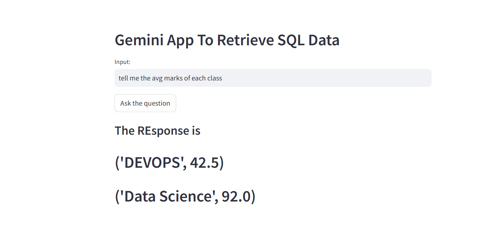

# End-to-End Text-to-SQL LLM App

This project demonstrates the power of natural language processing to simplify data querying. By leveraging Google Gemini Pro, we've built an application that allows users to interact with a SQL database using plain English questions. 

**How it works:**

1. **User Input:** The user enters a natural language question about the database.
2. **Query Generation:** The Gemini Pro model processes the question and generates an equivalent SQL query.
3. **Database Execution:** The generated SQL query is executed against the specified database.
4. **Result Display:** The results of the query are displayed to the user.

**Key Features:**

* **Natural Language Interface:** Users can interact with the database without needing to know SQL.
* **Gemini Pro Power:** Leverages the advanced capabilities of Google's Gemini Pro language model.
* **Flexible Database Connectivity:** Can be adapted to work with various database systems.
* **User-Friendly Interface:** Provides a simple and intuitive user experience.

**Getting Started:**

1. **Set up Environment:**
   - Install required libraries: `pip install streamlit sqlite3 google-generativeai`
   - Set up a Google Cloud Platform project and enable the Generative AI API.
   - Obtain an API key and set it as an environment variable.

2. **Run the App:**
   - Execute the `app.py` script: `streamlit run app.py`

**Technical Details:**

* **Frontend:** Streamlit
* **Backend:** Python, SQLite3
* **Language Model:** Google Gemini Pro

**Future Improvements:**

* **Enhanced Query Complexity:** Explore more complex queries and data manipulations.
* **Contextual Understanding:** Improve the model's ability to understand the context of questions.
* **Error Handling and Feedback:** Implement robust error handling and provide informative feedback to users.

For more details, refer to the code comments and the project structure.
